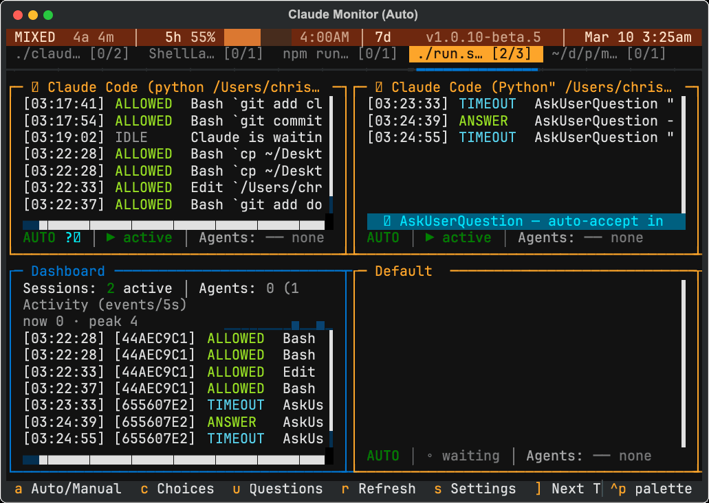
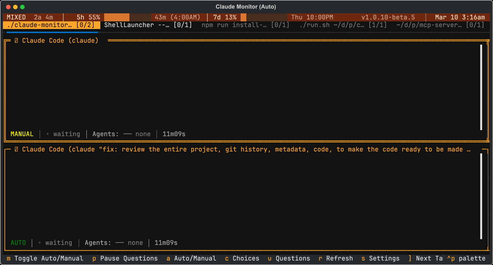
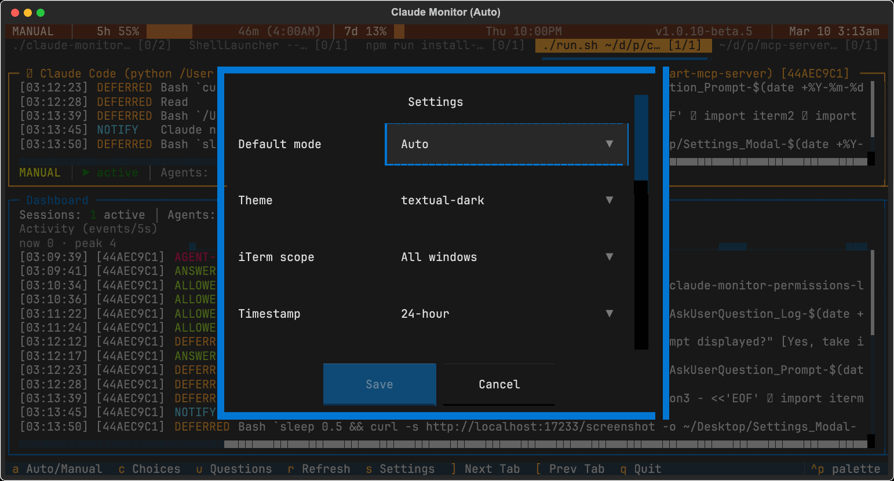
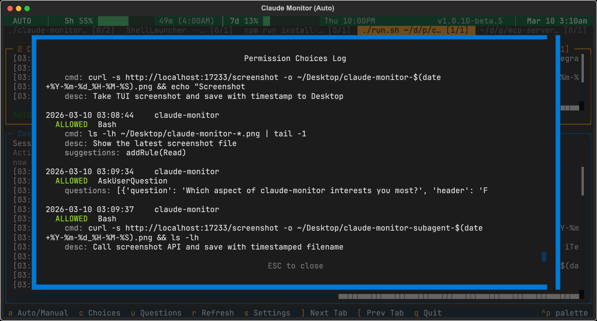
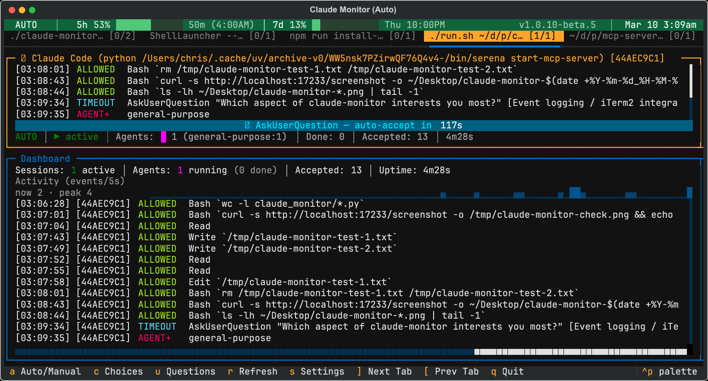
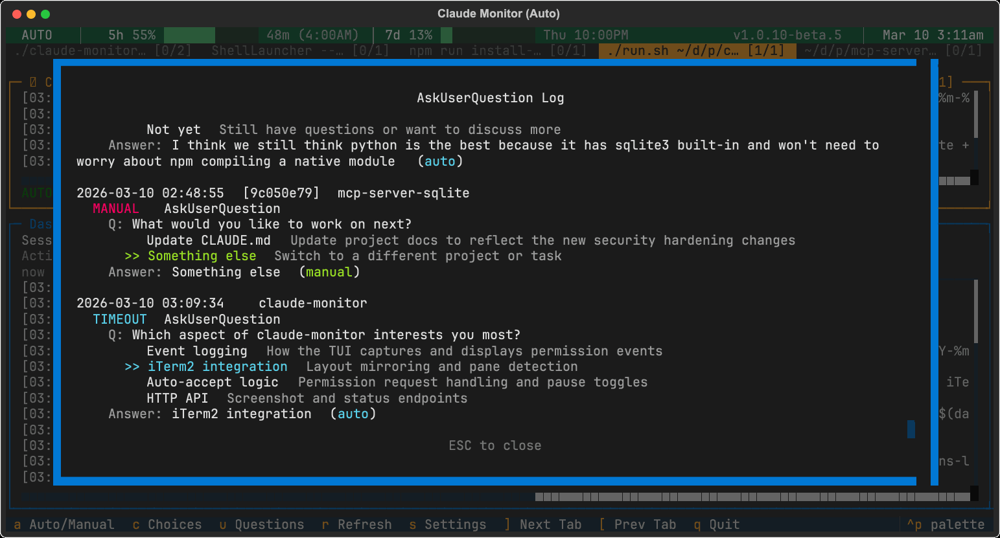
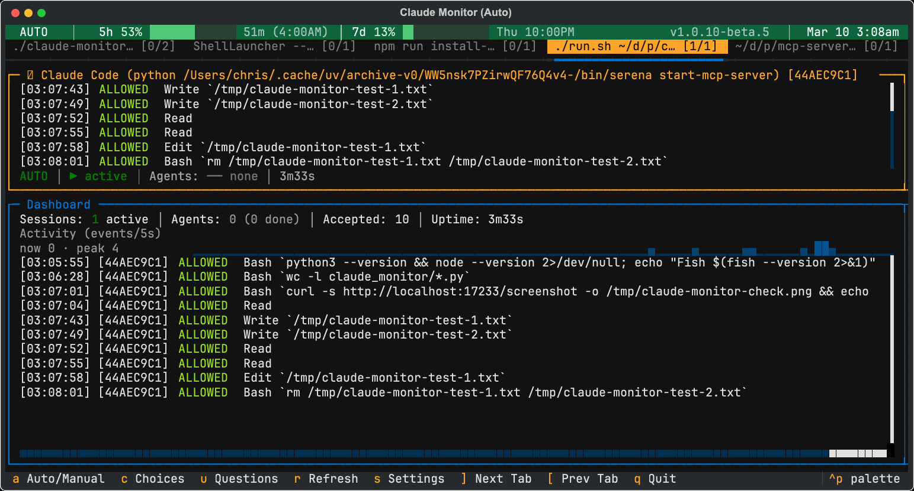

# claude-monitor

A terminal UI that monitors and auto-accepts Claude Code permission prompts. Works with iTerm2 pane mirroring on macOS or as a simple tabbed TUI on any platform.


claude-monitor runs alongside your Claude Code sessions. It auto-accepts permission prompts so sessions run unattended, and gives you a live dashboard of activity across all sessions. On macOS with iTerm2, it mirrors your exact pane layout. On Linux or other terminals, it runs in simple tabbed mode.

## Features

- **Auto-accept permissions** — Automatically allows Claude Code permission requests so sessions run hands-free.
- **Per-pane mode control** — Toggle individual panes between auto and manual mode, or use the global toggle. Click a panel's status bar or press `m` on a focused panel.
- **iTerm2 layout mirroring** — Reads your iTerm2 pane tree and builds a matching TUI layout with proportional sizing. Each iTerm2 pane gets a corresponding panel.
- **Multi-tab support** — Monitors panes across multiple iTerm2 tabs, rendered as a `TabbedContent` widget. Single-tab layouts skip the tab UI entirely.
- **Live event feed** — Displays permission requests, notifications, and agent spawns/stops per session in real time, with color-coded labels.
- **Simple mode** — Tabbed TUI that works on any platform without iTerm2. Auto-detects sessions via the event log. Use `--simple` flag or run outside iTerm2.
- **Resizable dashboard** — Grow (`=`) or shrink (`-`) the dashboard pane. Press `d` to minimize to a one-line summary; press `d` again to restore. Height persists across restarts.
- **Aggregate dashboard** — Combined feed from all sessions with stats (instances, agents, approved requests with tool breakdown), activity sparkline, and uptime.
- **Agent tracking** — Tracks subagent lifecycle (start/stop) per session with active counts, type breakdowns, and completion totals.
- **API usage bar** — Optional status bar widget showing 5-hour and 7-day Anthropic API quota utilization with progress bars, color coding, and reset countdowns. Uses your OAuth token from the macOS Keychain.
- **Settings modal** — Configure mode, theme, iTerm scope, timestamp style, and more. Persists across sessions.
- **Command palette** — Quick access to all commands via `Ctrl+P`.
- **Worktree detection** — Sessions running in git worktrees are detected and displayed with distinct `WT:` titles and styling.
- **Smart layout polling** — Detects pane adds/removes every 3 seconds and rebuilds the layout while preserving event history, panel state, active tab, and focused panel. Resizes update CSS proportions without rebuilding. Unmatched sessions automatically get fallback panels.
- **20 themes** — Choose from textual-dark, dracula, catppuccin, nord, gruvbox, tokyo-night, and more.
- **HTTP API** — Localhost API on port 17233 for external tools. Endpoints for health checks, PNG/SVG screenshots, and structured JSON state.
- **Version + clock** — Right-aligned version number and live clock in the status bar.

## Screenshots

### Multi-pane layout
The TUI reads your iTerm2 pane tree and **renders an exact visual replica** of the split layout. Each iTerm2 pane becomes a panel in the TUI with proportional sizing — vertical and horizontal splits are mirrored precisely. In this example, the top-left and top-right panels show two Claude Code sessions running side-by-side, with the dashboard and a default session below. The layout updates every 3 seconds to detect new panes or resizes.



### Auto and Manual modes
Toggle individual panes between auto-accept and manual approval modes. The status bar shows the current mode and counts of auto/manual panes.



### Settings modal
Configure theme, mode defaults, iTerm2 scope, timestamp style, and API usage tracking.



### Permission choices log
View detailed logs of all permission requests, with full command text and descriptions.



### AskUserQuestion timeout countdown
When a permission is paused (manual mode), a countdown timer appears. The hook waits for the timeout before auto-accepting in manual mode. Shows the active question and countdown.



### AskUserQuestion log
Track all AskUserQuestion events across sessions with full question/answer history.



### Dashboard and session layout
Main view showing the aggregate dashboard (left) with stats and activity sparkline, plus a Claude Code session panel (right) with live event feed.



## Requirements

- **Python 3.12+**
- **Claude Code** installed
- **macOS + iTerm2** (for full pane-mirroring mode): iTerm2 with Python API enabled (Preferences > General > Magic > Enable Python API)
- **Linux / other terminals**: Works in simple tabbed mode — no iTerm2 needed

## Installation

```bash
git clone https://github.com/cjthompson/claude-monitor.git
cd claude-monitor
python3 install.py
```

The install script:

1. Creates a `.venv` and installs the package in editable mode
2. Symlinks `claude-monitor` and `claude-monitor-hook` to `~/.local/bin/`
3. Configures Claude Code hooks in `~/.claude/settings.json` (interactive — asks before writing)

Make sure `~/.local/bin` is on your `$PATH`.

### Manual installation

```bash
python3 -m venv .venv
.venv/bin/pip install -e .
```

Then add hooks to `~/.claude/settings.json` manually (see [How it works](#how-it-works) below).

## Usage

```bash
# Auto-restarts on quit
./run.sh

# Or run directly
claude-monitor

# Force simple tabbed mode (no iTerm2 required)
claude-monitor --simple
```

On macOS with iTerm2, run this in an iTerm2 pane alongside your Claude Code sessions — the TUI will discover all panes and mirror the layout. Outside iTerm2 or on Linux, simple mode is used automatically.

### Keybindings

| Key | Action |
|---|---|
| `a` | Toggle global Auto/Manual mode |
| `m` | Toggle focused panel's Auto/Manual mode |
| `d` | Minimize/restore dashboard (stores height for restore) |
| `D` | Toggle dashboard as a tab |
| `=` | Grow dashboard pane |
| `-` | Shrink dashboard pane |
| `r` | Refresh iTerm2 layout |
| `s` | Open settings |
| `c` | View choices log |
| `u` | View questions log |
| `]` | Next tab |
| `[` | Previous tab |
| `x` | Close current session tab (auto-recreates if session is still active) |
| `Ctrl+P` | Open command palette |
| `Tab` | Move focus between panels |
| `q` | Quit |

### Modes

- **Auto** (default) — Permission prompts are automatically accepted. Status bar shows green.
- **Manual** — Permission prompts are shown to the user. Status bar shows yellow.
- **Mixed** — Some panes auto, some manual. Status bar shows yellow with counts (e.g. `MIXED  3a 1m`).

Global toggle with `a`. Per-pane toggle by clicking a panel's status bar or pressing `m` on a focused panel. In global manual mode, clicking a panel switches it to auto while keeping others manual. From a mixed state, pressing `a` clears all pause state (sets everything to auto); from all-auto it switches to all-manual.

## Settings

Press `s` to open the settings modal. Settings persist to `~/.config/claude-monitor/config.json`.

| Setting | Options | Default | Description |
|---|---|---|---|
| Default mode | `auto`, `manual`, `last_used` | `auto` | Starting mode when the TUI launches |
| Theme | 20 themes | `textual-dark` | UI color theme |
| Debug | on/off | off | Log debug output to `/tmp/claude-auto-accept/tui-debug.log` |
| iTerm scope | `current_tab`, `current_window`, `all_windows` | `current_tab` | Which iTerm2 tabs to monitor |
| Timestamp style | `12hr`, `24hr`, `date_time`, `auto` | `24hr` | How timestamps are formatted in event logs |
| Account usage | on/off | off | Show API usage bar |

### Available themes

textual-dark, textual-light, textual-ansi, atom-one-dark, atom-one-light, catppuccin-frappe, catppuccin-latte, catppuccin-macchiato, catppuccin-mocha, dracula, flexoki, gruvbox, monokai, nord, rose-pine, rose-pine-dawn, rose-pine-moon, solarized-dark, solarized-light, tokyo-night

## API Usage Bar

Enable via Settings > Account usage. Displays your Anthropic API rate limit utilization.

- **macOS**: Reads OAuth token from the macOS Keychain (`Claude Code-credentials`), cached until expiry
- **Linux**: Set `CLAUDE_CODE_OAUTH_TOKEN` env var or add it to a `.env` file in the project root
- Fetches from `api.anthropic.com/api/oauth/usage` every 5 minutes; status bar updates every 30 seconds
- Shows 5-hour and 7-day usage windows with progress bars and reset countdowns
- Color coded: green (<40%), yellow (<60%), orange (<80%), red (>=80%)
- Width-responsive: full bars at wide widths, percentages only when narrow

## How it works

### State management

Two files in `/tmp/claude-auto-accept/`:

- **`state.json`** — Shared state read by the hook and written by the TUI. Contains `global_paused` (bool) and `paused_sessions` (list of iTerm session UUIDs).
- **`events.jsonl`** — Append-only event log. The hook appends; the TUI tails. Kept separate because append-only streaming doesn't suit a JSON state file.

### Hook

Claude Code calls `claude-monitor-hook` on four event types via the hooks config in `~/.claude/settings.json`:

| Event | Description |
|---|---|
| `PermissionRequest` | Claude wants to run a tool (Bash, Edit, Write, etc.) |
| `Notification` | Permission prompt or idle prompt notification |
| `SubagentStart` | A subagent has started |
| `SubagentStop` | A subagent has completed |

The hook writes every event as a JSON line to `events.jsonl`, tagged with the iTerm2 session ID and timestamp. For permission requests, it reads `state.json` to check both global and per-session pause state. If paused, it exits silently and Claude Code shows the normal prompt. Otherwise, it responds with an allow decision.

### TUI

The TUI tails the events JSONL file and routes events to the correct panel using the iTerm2 session ID. It connects to the iTerm2 Python API via WebSocket to read the pane layout and polls every 3 seconds for changes.

Layout changes are detected via two fingerprints:
- **Structure** (session IDs, tab IDs, split directions) — triggers a full widget tree rebuild with state transfer
- **Size** (pixel dimensions) — triggers lightweight CSS percentage updates, no rebuild

The TUI's own pane is detected via the `ITERM_SESSION_ID` environment variable and shows a dashboard instead of a session panel. Events from sessions not matching any known pane automatically get fallback panels. Sessions running in git worktrees are detected and displayed with `WT:` prefixed titles and distinct border styling.

During a manual refresh (`r`), the status bar shows "REFRESHING layout..." in accent color. If the iTerm2 connection fails, it shows "REFRESH FAILED".

### Event display

Each event is color-coded in the session panel's log:

| Label | Color | Meaning |
|---|---|---|
| `ALLOWED` | Green | Permission auto-accepted |
| `PAUSED` | Yellow | Permission logged but not auto-accepted (manual mode) |
| `APPROVED` | Green | Permission prompt notification auto-approved via keystroke |
| `IDLE` | Dim | Session idle notification |
| `AGENT+` | Bold magenta | Subagent started |
| `AGENT-` | Magenta | Subagent stopped |

Permission events show additional detail: the command for Bash tools (multi-line commands collapsed with ↵), the file path for Edit/Write, and the URL for WebFetch.

### Panel status bar

Each session panel has a status bar showing:
- Mode: `AUTO` (green) or `MANUAL` (yellow) — click to toggle
- State: `▶ active`, `⏸ idle`, or `◦ waiting`
- Active agents with type breakdown
- Completed agent count
- Accepted permission count
- Uptime

### Global status bar

Top bar showing:
- Left: mode (`AUTO` / `MANUAL` / `MIXED 3a 1m`) + optional API usage
- Right: version number + live clock

## HTTP API

The monitor runs a lightweight HTTP server on `localhost:17233` for external tools (e.g. Telegram bots).

| Endpoint | Returns | Description |
|----------|---------|-------------|
| `GET /health` | JSON | `{"status": "ok", "version": "...", "uptime": 123}` |
| `GET /screenshot` | PNG | Screenshot of the TUI (256-color optimized, ~114K) |
| `GET /screenshot?format=svg` | SVG | Raw SVG screenshot |
| `GET /text` | JSON | Structured state: sessions, dashboard, usage data |

The screenshot uses Textual's internal rendering, so it works even when the window is hidden or minimized. Port is written to `/tmp/claude-auto-accept/api-port` for discovery.

## Project structure

```
claude_monitor/
  __init__.py      # Version, shared constants, utilities
  api.py           # HTTP API server — /health, /screenshot, /text endpoints
  hook.py          # Claude Code hook — auto-accepts permissions, logs events
  tui.py           # Full TUI — mirrors iTerm2 pane layout (macOS only)
  tui_simple.py    # Simple TUI — tabbed layout, works on any platform
  tui_common.py    # Shared widgets: SessionPanel, DashboardPanel, modals, commands
  settings.py      # Settings dataclass, persistence, and modal screen
  usage.py         # OAuth token extraction, API usage fetching, usage bar widget
install.py         # Setup script — venv, symlinks, hook configuration
run.sh             # Wrapper script — auto-restarts on quit
pyproject.toml     # Package config with entry points
```

## Debugging

```bash
tail -f /tmp/claude-auto-accept/tui-debug.log
```

Enable debug logging in Settings (`s` > Debug > on).

Event log:
```bash
tail -f /tmp/claude-auto-accept/events.jsonl | python3 -m json.tool
```

State file:
```bash
cat /tmp/claude-auto-accept/state.json | python3 -m json.tool
```

## Dependencies

- [textual](https://github.com/Textualize/textual) >= 1.0 — TUI framework
- [iterm2](https://iterm2.com/python-api/) >= 2.14 — iTerm2 Python API (macOS only, optional on Linux)
- [cairosvg](https://cairosvg.org/) — SVG to PNG conversion for API screenshots
